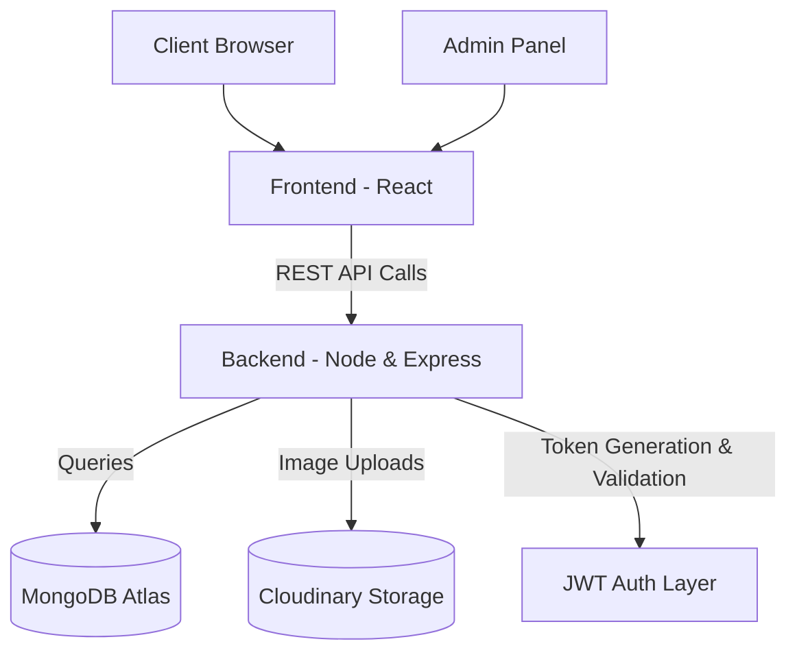
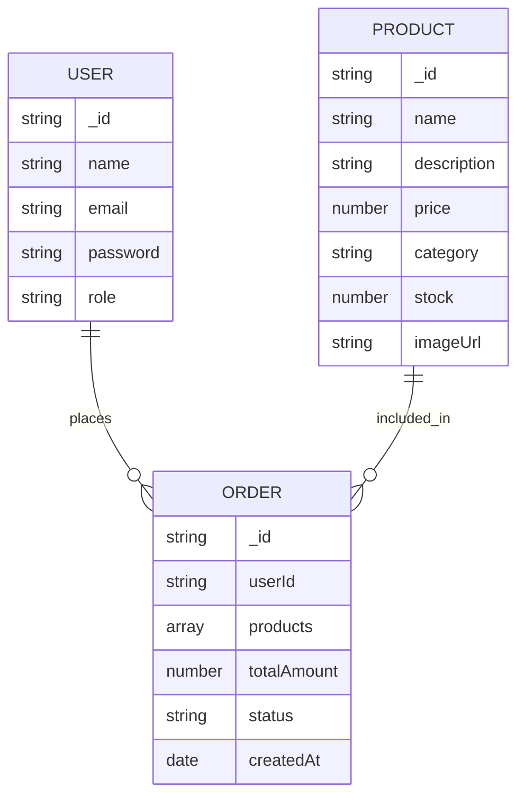
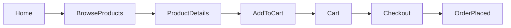
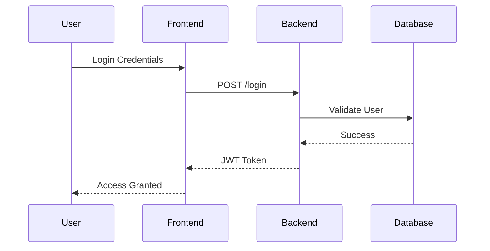

# FOREVER - Clothing E-Commerce Platform (MERN)

A production-ready full-stack E-Commerce platform built using the MERN stack with scalable architecture, JWT authentication, cloud-based media storage, and modular backend design.

---

# Live Demo

Frontend (User Website):  
https://forever-clothing-e-commerce-platform-li17.onrender.com/

Admin Panel:  
https://forever-clothing-e-commerce-platform-sfgd.onrender.com/

---

# Sample Credentials

User Login  
Email: user1@gmail.com  
Password: user1123  

---

# Tech Stack

- MongoDB (Database)
- Express.js (Backend Framework)
- React.js (Frontend Library)
- Node.js (Runtime Environment)
- JWT (Authentication)
- Cloudinary (Media Storage)

---

# Screenshots

## Home Page


## Collections Page


## Cart Page


## Place Order - Cash On Delivery


## Orders Page


## Place Order - Stripe


---

# System Design Overview

This project is designed following scalable full-stack architecture principles with clear separation between presentation, business logic, and data layers.

## Core Design Goals

- Clear separation of concerns  
- Stateless authentication  
- Scalable database structure  
- Cloud-based media handling  
- Role-based access control  
- Modular backend architecture  

---

# High-Level Architecture



---

# Architecture Explanation

## Frontend Layer (React)

- Handles UI rendering and routing  
- Maintains client-side state  
- Sends REST API requests  
- Stores JWT token securely  
- Implements protected routes  

---

## Backend Layer (Node.js + Express)

- Implements RESTful APIs  
- Handles business logic  
- Generates & validates JWT tokens  
- Role-based middleware protection  
- Integrates Cloudinary for media uploads  
- Structured error handling  

---

## Database Layer (MongoDB Atlas)

- NoSQL document-based storage  
- Flexible schema design  
- Indexed queries for performance  

Collections:
- Users  
- Products  
- Orders  

---

## Cloud Storage

- Product images stored in Cloudinary  
- Only image URLs saved in database  
- Reduces backend storage load  
- Improves scalability  

---

## Authentication Strategy

- JWT-based stateless authentication  
- Token generated at login  
- Sent in Authorization headers  
- Middleware validates token  
- Admin routes validate role before access  

---

# Database Design (ER Diagram)



---

# Application Flow

## User Shopping Flow



---

## Authentication Flow



---

# Project Structure

```
Forever-Clothing/
│
├── backend/
│   ├── controllers/
│   ├── models/
│   ├── routes/
│   ├── middleware/
│   ├── config/
│   └── server.js
│
├── frontend/
│   ├── components/
│   ├── pages/
│   ├── context/
│   ├── assets/
│   └── App.js
│
└── README.md
```

---

# Environment Setup

## Backend `.env`

```
PORT=4000
MONGODB_URI=your_mongodb_connection_string
JWT_SECRET=your_secret_key
CLOUD_NAME=your_cloud_name
CLOUD_API_KEY=your_api_key
CLOUD_API_SECRET=your_api_secret
```

---

# Installation

```bash
git clone https://github.com/bvlchowdary2006-alt/Forever-Clothing-E-Commerce-Platform-using-MERN.git
cd Forever-Clothing-E-Commerce-Platform-using-MERN
```

### Install Backend

```bash
cd backend
npm install
npm run dev
```

### Install Frontend

```bash
cd frontend
npm install
npm start
```

---

# Security Implementation

- Password hashing using Bcrypt  
- JWT token validation middleware  
- Role-based route protection  
- Environment variable protection  
- API input validation  

---

# Scalability Considerations

- Stateless authentication  
- Cloud-based image hosting  
- Modular backend structure  
- Ready for payment gateway integration  
- Redis caching can be added  
- Easily migratable to microservices  

---

# Why This Project Stands Out

- Clean layered architecture  
- Interview-ready system design explanation  
- Production-like implementation  
- Real-world e-commerce logic  
- Scalable backend foundation  
